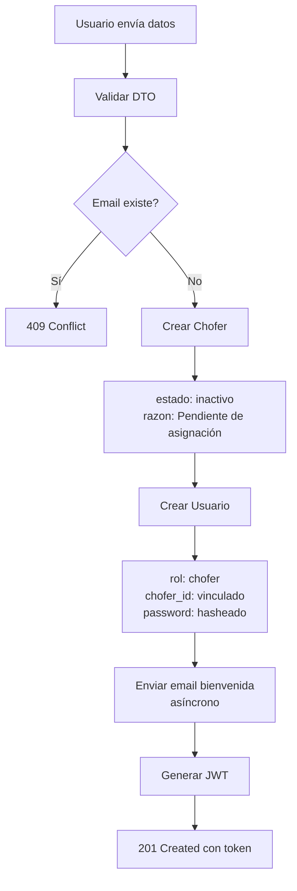
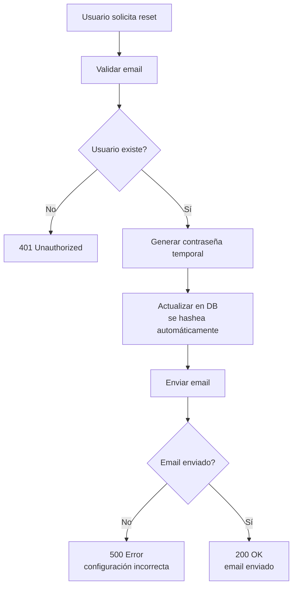

# Sistema de Autenticación - Registro y Recuperación de Contraseña

## Resumen de Implementación

Se han implementado dos nuevos endpoints de autenticación con validación completa, servicio de email y manejo de errores consistente.

## Endpoints Implementados

### 1. POST `/api/v1/auth/register` - Registro de Nuevos Usuarios

**Descripción:** Permite a nuevos choferes registrarse en el sistema.

**Request Body:**
```json
{
  "nombre_completo": "Juan Carlos Pérez",
  "email": "juan.perez@transporte.com",
  "password": "password123"
}
```

**Validaciones:**
- `nombre_completo`: String, mínimo 3 caracteres, máximo 100 caracteres
- `email`: Email válido, único en la base de datos, transformado a minúsculas
- `password`: String, mínimo 6 caracteres

**Proceso:**
1. Valida que el email no esté registrado
2. Crea un nuevo **chofer** con:
   - `nombre_completo`: del request
   - `estado_chofer`: `'inactivo'`
   - `razon_estado`: `'Pendiente de asignación'`
3. Crea un nuevo **usuario** con:
   - `email`: del request (en minúsculas)
   - `password`: hasheado con bcrypt
   - `nombre`: nombre_completo
   - `rol`: `'chofer'`
   - `chofer_id`: ID del chofer creado
   - `activo`: `true`
4. Envía email de bienvenida (asíncrono, no bloqueante)
5. Genera token JWT con chofer_id incluido
6. Retorna token y datos del usuario

**Response Exitoso (201 Created):**
```json
{
  "access_token": "eyJhbGciOiJIUzI1NiIsInR5cCI6IkpXVCJ9...",
  "usuario": {
    "usuario_id": 5,
    "email": "juan.perez@transporte.com",
    "nombre": "Juan Carlos Pérez",
    "rol": "chofer",
    "chofer_id": 12
  }
}
```

**Errores Posibles:**
- `400 Bad Request`: Validación fallida (email inválido, nombre muy corto, etc.)
- `409 Conflict`: Email ya registrado

---

### 2. POST `/api/v1/auth/forgot-password` - Recuperación de Contraseña

**Descripción:** Genera una contraseña temporal y la envía por email.

**Request Body:**
```json
{
  "email": "juan.perez@transporte.com"
}
```

**Validaciones:**
- `email`: Email válido, transformado a minúsculas

**Proceso:**
1. Valida que el email existe en la base de datos
2. Genera una contraseña temporal segura (16 caracteres alfanuméricos)
3. Actualiza la contraseña del usuario (se hashea automáticamente)
4. Envía email con la nueva contraseña temporal
5. Retorna confirmación de envío

**Response Exitoso (200 OK):**
```json
{
  "mensaje": "Se ha enviado un correo con tu nueva contraseña temporal",
  "email": "juan.perez@transporte.com"
}
```

**Errores Posibles:**
- `400 Bad Request`: Email inválido
- `401 Unauthorized`: Email no encontrado en la base de datos
- `500 Internal Server Error`: Error al enviar email (configuración incorrecta)

---

## Archivos Creados/Modificados

### 📁 DTOs (Data Transfer Objects)

#### `src/auth/dto/register.dto.ts`
```typescript
import { IsEmail, IsString, MinLength, MaxLength } from 'class-validator';
import { Transform } from 'class-transformer';

export class RegisterDto {
  @IsString({ message: 'El nombre completo debe ser un texto' })
  @MinLength(3, { message: 'El nombre completo debe tener al menos 3 caracteres' })
  @MaxLength(100, { message: 'El nombre completo no puede exceder 100 caracteres' })
  nombre_completo: string;

  @IsEmail({}, { message: 'El email no es válido' })
  @Transform(({ value }) => value.toLowerCase())
  email: string;

  @IsString({ message: 'La contraseña debe ser un texto' })
  @MinLength(6, { message: 'La contraseña debe tener al menos 6 caracteres' })
  password: string;
}
```

#### `src/auth/dto/forgot-password.dto.ts`
```typescript
import { IsEmail } from 'class-validator';
import { Transform } from 'class-transformer';

export class ForgotPasswordDto {
  @IsEmail({}, { message: 'El email no es válido' })
  @Transform(({ value }) => value.toLowerCase())
  email: string;
}
```

### 📁 Servicio de Email

#### `src/mail/mail.service.ts`
Servicio completo con Nodemailer que incluye:
- `sendWelcomeEmail()`: Email de bienvenida con HTML y texto plano
- `sendPasswordRecoveryEmail()`: Email de recuperación con contraseña temporal
- Configuración via variables de entorno
- Logging de errores y éxitos

#### `src/mail/mail.module.ts`
Módulo que exporta MailService para uso en otros módulos.

### 📁 Actualizaciones en Auth

#### `src/auth/auth.service.ts`
**Método `register()`:**
- Crea chofer y usuario vinculados
- Rol automático: CHOFER
- Estado automático: INACTIVO
- Genera JWT con chofer_id
- Envía email de bienvenida

**Método `forgotPassword()`:**
- Genera contraseña temporal segura
- Actualiza contraseña en DB (se hashea automáticamente)
- Envía email con nueva contraseña
- Manejo de errores de email

#### `src/auth/auth.controller.ts`
Agregados endpoints:
- `POST /api/v1/auth/register` → HTTP 201
- `POST /api/v1/auth/forgot-password` → HTTP 200

#### `src/auth/auth.module.ts`
- Importa MailModule para envío de emails
- Importa Chofer repository para creación de choferes

### 📁 Main Application

#### `src/main.ts`
Agregado:
```typescript
app.useGlobalPipes(
  new ValidationPipe({
    whitelist: true,
    forbidNonWhitelisted: true,
    transform: true,
  }),
);
```

Esto habilita:
- Validación automática de DTOs
- Transformación de tipos
- Eliminación de propiedades no permitidas

### 📁 Configuración

#### `.env.example`
Archivo de ejemplo con todas las variables necesarias:
- Variables de base de datos
- Variables de JWT
- **Variables de email (nuevo):**
  - `MAIL_HOST`: Servidor SMTP
  - `MAIL_PORT`: Puerto SMTP
  - `MAIL_SECURE`: SSL/TLS
  - `MAIL_USER`: Usuario de email
  - `MAIL_PASSWORD`: Contraseña de email
  - `MAIL_FROM`: Remitente

Incluye ejemplos para:
- Gmail
- Outlook
- Yahoo
- SendGrid

---

## Dependencias Instaladas

```bash
npm install nodemailer @types/nodemailer
npm install class-validator class-transformer
```

---

## Configuración de Email

### Opción 1: Gmail (Recomendado para desarrollo)

1. Crea una **Contraseña de Aplicación** en tu cuenta de Google:
   - Ve a https://myaccount.google.com/security
   - Activa verificación en 2 pasos
   - Genera una "Contraseña de aplicación"

2. Agrega a tu archivo `.env`:
```env
MAIL_HOST=smtp.gmail.com
MAIL_PORT=587
MAIL_SECURE=false
MAIL_USER=tu_email@gmail.com
MAIL_PASSWORD=tu_contraseña_de_aplicacion
MAIL_FROM="Sistema de Transporte <noreply@transporte.com>"
```

### Opción 2: Mailtrap (Recomendado para testing)

Mailtrap es un servicio que captura emails sin enviarlos realmente:

1. Registrate en https://mailtrap.io (gratis)
2. Obtén las credenciales SMTP
3. Agrega a tu `.env`:
```env
MAIL_HOST=smtp.mailtrap.io
MAIL_PORT=2525
MAIL_USER=tu_usuario_mailtrap
MAIL_PASSWORD=tu_password_mailtrap
MAIL_FROM="Sistema de Transporte <noreply@transporte.com>"
```

### Opción 3: SendGrid (Recomendado para producción)

```env
MAIL_HOST=smtp.sendgrid.net
MAIL_PORT=587
MAIL_USER=apikey
MAIL_PASSWORD=tu_api_key_de_sendgrid
MAIL_FROM="Sistema de Transporte <noreply@transporte.com>"
```

---

## Testing

### Script de Prueba

Ejecutar:
```bash
node test-auth-register-forgot.js
```

**IMPORTANTE:** Reiniciar el servidor antes de ejecutar los tests:
```bash
npm run start:dev
```

### Tests Incluidos

El script `test-auth-register-forgot.js` ejecuta:

**Sección 1: Registro (5 tests)**
1. Registro exitoso con datos válidos → 201
2. Email duplicado rechazado → 409
3. Validación de nombre (< 3 chars) → 400
4. Validación de email inválido → 400
5. Validación de contraseña (< 6 chars) → 400

**Sección 2: Login (1 test)**
6. Login con usuario recién registrado → 200

**Sección 3: Recuperación (3 tests)**
7. Forgot password con email existente → 200
8. Email inexistente → 401
9. Email inválido → 400

**Sección 4: Verificación (1 test)**
10. Verificar que el chofer fue creado correctamente en la DB

### Verificación Manual con cURL

**Registro:**
```bash
curl -X POST http://localhost:3000/api/v1/auth/register \
  -H "Content-Type: application/json" \
  -d '{
    "nombre_completo": "Test User",
    "email": "test@transporte.com",
    "password": "password123"
  }'
```

**Forgot Password:**
```bash
curl -X POST http://localhost:3000/api/v1/auth/forgot-password \
  -H "Content-Type: application/json" \
  -d '{
    "email": "test@transporte.com"
  }'
```

---

## Flujo Completo de Registro



---

## Flujo de Recuperación de Contraseña



---

## Seguridad

### ✅ Buenas Prácticas Implementadas

1. **Contraseñas hasheadas con bcrypt**
   - Se hashean automáticamente en el hook `@BeforeInsert` y `@BeforeUpdate`
   - Salt rounds: 10

2. **Validación de entrada**
   - DTOs con class-validator
   - Transformación de emails a minúsculas
   - Límites de longitud

3. **Emails no bloqueantes**
   - Email de bienvenida se envía async
   - No bloquea el registro si falla

4. **Contraseñas temporales seguras**
   - 16 caracteres alfanuméricos
   - Mayúsculas y minúsculas
   - Usuario debe cambiarla

5. **Tokens JWT seguros**
   - Incluyen chofer_id para autorización
   - Expiración de 7 días

### ⚠️ Consideraciones de Seguridad

1. **Secret de JWT en producción:**
   - Cambiar `JWT_SECRET` en .env
   - Usar un secreto fuerte y único

2. **Email en producción:**
   - Usar un servicio profesional (SendGrid, AWS SES)
   - No usar Gmail directamente

3. **Rate Limiting:**
   - Implementar límite de intentos de registro
   - Límite de intentos de forgot-password

4. **HTTPS obligatorio:**
   - En producción usar solo HTTPS
   - Las contraseñas se envían en el body

---

## Formato de Emails

### Email de Bienvenida

**Asunto:** Bienvenido al Sistema de Transporte

**Contenido HTML:**
- Saludo personalizado
- Confirmación de cuenta creada
- Info sobre estado inicial (Inactivo)
- Mensaje de bienvenida al equipo

**Contenido Texto Plano:**
- Mismo contenido en formato texto simple
- Para clientes de email sin soporte HTML

### Email de Recuperación

**Asunto:** Recuperación de Contraseña - Sistema de Transporte

**Contenido HTML:**
- Información de acceso
- Email y contraseña temporal
- Recomendación de cambiarla
- Nota de seguridad

---

## Próximos Pasos Opcionales

1. **Endpoint para cambiar contraseña**
   - `PATCH /api/v1/auth/change-password`
   - Requiere contraseña actual y nueva contraseña

2. **Verificación de email**
   - Enviar código de verificación al registrarse
   - Endpoint para verificar el código

3. **Rate Limiting**
   - Limitar intentos de registro por IP
   - Limitar intentos de forgot-password

4. **Refresh Tokens**
   - Implementar tokens de corta duración
   - Refresh token para renovar sin login

5. **2FA (Autenticación de dos factores)**
   - SMS o app authenticator
   - Para usuarios admin

---

## Troubleshooting

### Error: "Internal server error" al registrar

**Causa:** Falta instalar class-validator y class-transformer

**Solución:**
```bash
npm install class-validator class-transformer
```

### Error 500 en forgot-password

**Causa:** Variables de email no configuradas en .env

**Solución:**
1. Copia `.env.example` a `.env`
2. Configura las variables `MAIL_*`
3. Reinicia el servidor

### Emails no se envían

**Verificar:**
1. ✅ Variables de email correctas en `.env`
2. ✅ Credenciales válidas (password de aplicación para Gmail)
3. ✅ Puerto correcto (587 para TLS, 465 para SSL)
4. ✅ Logs del servidor para ver errores específicos

### Usuario registrado pero no aparece

**Verificar:**
1. Check en tabla `usuarios` que el usuario existe
2. Check en tabla `choferes` que el chofer fue creado
3. Verificar que `chofer_id` en usuario apunta al chofer correcto

---

## Resumen de Cambios

### ✅ Archivos Creados
- `src/auth/dto/register.dto.ts`
- `src/auth/dto/forgot-password.dto.ts`
- `src/mail/mail.service.ts`
- `src/mail/mail.module.ts`
- `.env.example`
- `test-auth-register-forgot.js`
- `BACKEND-AUTH-REGISTER-FORGOT-PASSWORD.md` (este archivo)

### ✅ Archivos Modificados
- `src/auth/auth.service.ts` - Métodos register() y forgotPassword()
- `src/auth/auth.controller.ts` - Endpoints POST register y forgot-password
- `src/auth/auth.module.ts` - Importa MailModule y Chofer repository
- `src/main.ts` - ValidationPipe global
- `package.json` - Nuevas dependencias

### ✅ Dependencias Agregadas
- `nodemailer`
- `@types/nodemailer`
- `class-validator`
- `class-transformer`

---

## Estado de Implementación

| Feature | Estado | Notas |
|---------|--------|-------|
| DTO de registro | ✅ | Con validación completa |
| DTO de forgot-password | ✅ | Validación de email |
| Endpoint de registro | ✅ | POST /api/v1/auth/register |
| Endpoint de forgot-password | ✅ | POST /api/v1/auth/forgot-password |
| Creación de chofer automática | ✅ | Estado inactivo por defecto |
| Vinculación usuario-chofer | ✅ | chofer_id en JWT |
| Validación global | ✅ | ValidationPipe en main.ts |
| Servicio de email | ✅ | Nodemailer configurado |
| Email de bienvenida | ✅ | HTML + texto plano |
| Email de recuperación | ✅ | Con contraseña temporal |
| Tests automatizados | ✅ | 10 tests en total |
| Documentación | ✅ | Este archivo |
| Configuración .env | ✅ | .env.example creado |

---

## Credenciales de Prueba

### Admin (existente)
```
Email: admin@transporte.com
Password: admin123
```

### Chofer (existente)
```
Email: carlos.andrada@transporte.com
Password: chofer123
```

### Nuevo Usuario (crear vía registro)
```
Usar el endpoint POST /api/v1/auth/register
```

---

🎉 **Sistema de autenticación completo implementado exitosamente**
